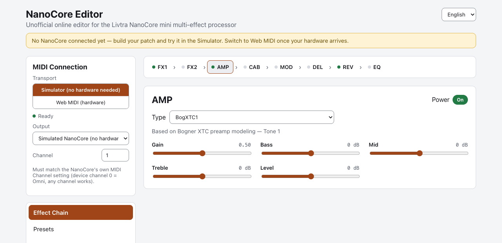
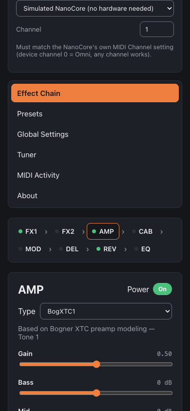

# NanoCore Editor

**Live: https://lucanenni.github.io/livtra-nanocore-editor/**

An unofficial, browser-based editor for the **Livtra NanoCore** mini multi-effect
processor. Build a patch — 8 effect blocks, each with its own type and
parameters — and push it live to the device over MIDI, straight from a static
web page. No install, no backend.

Originally built ahead of owning the hardware — everything can still be
exercised end-to-end without a device via the built-in **Simulator**
transport — and since verified against a real NanoCore over **Web MIDI**.

<picture>
  <source media="(prefers-color-scheme: dark)" srcset="docs/screenshots/editor-desktop-dark.png">
  <source media="(prefers-color-scheme: light)" srcset="docs/screenshots/editor-desktop-light.png">
  
</picture>



Responsive down to phone widths — the sidebar (MIDI connection + section nav)
stacks above the effect chain instead of sitting beside it.

<br clear="right">

## Status

**Verified against a real NanoCore** (firmware 1.04+) — see
[`docs/HARDWARE_VERIFICATION.md`](docs/HARDWARE_VERIFICATION.md) for the full
checklist and [`docs/MIDI_MAPPING_NOTES.md`](docs/MIDI_MAPPING_NOTES.md) for
the detailed findings log (a few range/typo fixes were needed along the way).

**USB and Bluetooth both confirmed working, two ways for Bluetooth.** Pick
**Web MIDI** and pair the NanoCore at the OS level first (macOS: Audio MIDI
Setup → MIDI Studio → Bluetooth) — it then shows up as a normal port, same as
USB — or pick **Bluetooth** to connect straight from the page instead (Web
Bluetooth, Chrome/Edge/Opera only), no OS pairing step needed. Either way,
toggle Bluetooth off/on on the device first to wake its advertising, and make
sure nothing else (like the official phone app) is already holding the
connection. See MIDI_MAPPING_NOTES.md for the full diagnosis story.

The parameter map (CC numbers, on/off conventions, type IDs) is taken directly
from Livtra's own documentation, and everything documented there works as expected
over MIDI, with one confirmed exception: **AMP and CAB model selection had no
effect over the documented CC protocol on earlier firmware** (a September 2026
NanoCore firmware update fixed CC43/44 for this — confirmed on real hardware,
see `docs/HARDWARE_VERIFICATION.md`/`docs/MIDI_MAPPING_NOTES.md`; this editor
is unaffected either way, since it already used SysEx for this and still does).
The manual's *ranges* for individual
parameters are less reliable than its CC numbers — one wrong floor is already
fixed (Compressor Ratio, "1.1:1" vs the device's actual 1:1) and a systematic
per-parameter check against real hardware is in progress, tracked in
[`docs/PARAM_VERIFICATION.md`](docs/PARAM_VERIFICATION.md). Model selection is
programmed via SysEx — not documented anywhere, but reverse-engineered from real
traffic between the official Livtra app and a real NanoCore (same hardware-
verification approach as everything else in this project, just applied to
SysEx). This isn't a workaround for CC43/44: SysEx is the pedal's real patch-
programming protocol, while CC is meant for live control while playing — model
selection was never really a CC-shaped action to begin with. Effect chain
reordering also went from undocumented-and-unsupported to working the same
way — see MIDI_MAPPING_NOTES.md for the full protocol write-up. Global
settings (Wireless, Loopback, Input Gain, USB/BT Volume, MIDI Channel) are
live the same way — see Known limitations below. The tuner's reference
pitch is the one remaining setting with no documented CC or known SysEx
equivalent, still shown as reference-only.

## Source material

The parameter map is built from Livtra's own official documentation (not
redistributed here — these are Livtra's to publish):

- **NANOCORE User Manual** — effect descriptions & real-world parameter ranges
  — <https://openparcelbox.com/manuals/NANOCORE-User-Manual.pdf>
- **NANOCORE MIDI Control User Guide** — CC numbers & value rules
  — <https://openparcelbox.com/manuals/NANOCORE-MIDI-Control-User-Guide.pdf>
- `docs/MIDI_MAPPING_NOTES.md` — assumptions made while turning those into code,
  plus every protocol detail reverse-engineered beyond what they document

## Running it

```bash
cd app
npm install
npm run dev
```

Open the printed localhost URL. The app tries **Web MIDI** first and falls
back to the **Simulator** transport if the browser doesn't support it or no
device is available — either way it's fully usable without a device, every
control still "sends" a MIDI-shaped message, visible (with a human-readable
description) in the **MIDI Activity** tab.

To build a static bundle for hosting anywhere (GitHub Pages, Netlify, a plain
file server…):

```bash
npm run build   # outputs to app/dist
```

Web MIDI (the real hardware path) needs a Chromium-based browser (Chrome,
Edge, Opera, …) and — outside of `localhost` — HTTPS, per the Web MIDI API spec.

## Portable version (single HTML file)

For a zero-install path — no `npm`, no hosting, no build step for whoever's
using it — there's a **portable build**: one self-contained `.html` file with
all JS/CSS inlined, closer in spirit to how
[suckyble/PocketEdit](https://github.com/suckyble/PocketEdit) ships (a single
`index.html`, open it and go) than to a normal Vite app.

```bash
cd app
npm run build:portable   # -> app/dist-portable/nanocore-editor-portable.html
```

That one file is the whole app. Double-click it to open it straight from disk,
drop it on a USB stick, attach it to a GitHub Release, or drop it on any
static file host — there's nothing else to copy alongside it and no server
required. Both the **Simulator** and real **Web MIDI** work from it: opening a
file with `file://` (or hosting it anywhere) is a secure context in Chromium
browsers, same as `npm run dev` or a normal deployed build, so hardware
connects normally — this is the file to hand someone who just wants the
editor without cloning the repo.

(There's a second single-file build, `npm run build:artifact` →
`app/dist-artifact/index.html`, used for publishing the editor as a Claude
Artifact. It's built the same way, but Claude's artifact iframe sandbox can
block real Web MIDI access, so treat that one as Simulator-only and use the
portable build — or a normal hosted deploy — once actual hardware is
involved.)

## How it's organized

```
app/src/
  data/            NanoCore spec: 8 blocks × effect types × parameters,
                    encoded from Livtra's manual + MIDI guide (data/blocks/*.ts)
  midi/            Web MIDI + Web Bluetooth (direct BLE-MIDI) + Simulator
                    transports behind one interface, plus the CC↔real-value
                    scaling helpers
  store/           zustand store: current patch, MIDI connection state,
                    activity log, local preset library
  components/      the editor UI
  i18n/            react-i18next setup; en.json is the reference locale
```

**Reads the device back.** The MIDI guide documents no way to do this, but the
official app clearly does — so it was reverse-engineered from the traffic. On
connect (and whenever you recall a preset on the device), the editor reads the
loaded preset's name and number, every block's on/off, type and parameter
values, and the effect-chain order, and shows them — reflecting the device's
actual **current** state, live edits included, not just whatever was last
saved to that slot. It also follows on/off, preset changes, and live knob
turns made on the device itself as they happen — flip a footswitch, recall a
different patch, or turn a physical knob, and the editor updates live.
Reconnecting (or recalling the preset again) re-syncs everything regardless,
as a fallback. See `docs/MIDI_MAPPING_NOTES.md`'s "Live device state via
opcode 0x63" section for the protocol details.

**Local preset library.** "Presets" in this editor are named patches saved in
the browser's `localStorage` (`Presets → Save as new preset`),
exportable/importable as JSON so they survive a cleared cache or move between
machines. **Send patch to device** pushes one to the device's *current* live
patch. **Save to device slot** (also under Presets) writes whatever the
device currently has loaded into one of its own preset slots — reverse-
engineered from a real capture of the official app doing exactly this (opcode
`0x46`, see `docs/MIDI_MAPPING_NOTES.md`); it saves the device's live state,
not this editor's patch directly, so use Send patch first if you want to save
what's on screen. **Rename patch on device** (also under Presets) renames the
device's own currently active/edited patch, up to its real 8-character limit
— also reverse-engineered from a real capture (opcode `0x6d`, field `0x08`).
Like any other live tweak, it isn't persisted until you Save to device slot
afterward.

**CC Reference.** A full table of every CC this editor's data model knows
about — on/off, type-select, and every parameter, for all 8 blocks plus the
global controls — sorted by CC number, with buttons to send a raw test value
straight to a connected device. Meant for configuring an external MIDI foot
controller for live use: look up which CC drives what you want, assign it on
the controller, then use these buttons to confirm the device actually reacts
before trusting the controller's own mapping.

## Translations

The UI is built to be translated from the start via `react-i18next`.
`app/src/i18n/locales/en.json` is the reference; `it.json` ships a full
translation of the interface chrome as a working example. Effect/parameter
names and descriptions (hundreds of strings pulled straight from the manual)
aren't duplicated into every locale file — they're looked up as
`t(key, englishDefault)`, so English always works even for keys a locale
hasn't translated yet. To add a language, copy `en.json`, translate its
values, register it in `app/src/i18n/index.ts`, and add it to
`SUPPORTED_LANGUAGES`; translating the data-driven content is optional and
incremental (add matching `type.*` / `param.*` keys as you go).

## CI

A GitHub Actions workflow (`.github/workflows/ci.yml`) runs lint, the full
Vitest suite, and a production build on every push/PR to `main`. It started
**disabled by default** (added while the repo was still private, to opt in
rather than spend the free plan's Actions minutes automatically) — now that
the repo is public, Actions minutes are unlimited on standard runners
regardless, so there's no real reason to leave it off:

```bash
gh workflow enable ci.yml     # turn on
gh workflow run ci.yml        # or just run it once, on demand
gh workflow disable ci.yml    # turn back off
```

(`.github/workflows/pages.yml`, the Pages deployment, is separate and always
enabled — see Deploying below.)

## Deploying (GitHub Pages)

Deploys automatically via GitHub Actions (`.github/workflows/pages.yml`,
using `actions/deploy-pages`) on every push to `main` that touches `app/` —
no build-output branch in the repo, no manual step. Trigger it by hand with
`gh workflow run pages.yml` if needed.

The workflow builds with a separate Vite config, `vite.pages.config.ts` —
distinct from the normal `npm run build` since a GitHub Pages **project
page** (`https://<user>.github.io/<repo>/`, not a custom domain) needs its
asset URLs prefixed with the repo name as a base path. Run
`npm run build:pages` locally only to preview that output in
`app/dist-pages/`; it's not meant to be deployed by hand.

First time only: repo → Settings → Pages → Build and deployment → Source →
**GitHub Actions** (or `gh api -X PUT repos/<owner>/<repo>/pages -f
build_type=workflow`).

Note: **Web MIDI needs HTTPS** (except on `localhost`) — GitHub Pages serves
over HTTPS by default, so hardware connection works fine there.

Don't want to host anything at all? See **Portable version** above —
`npm run build:portable` gives you a single `.html` file that just works when
opened directly, no Pages/hosting setup needed.

## Tips

**Emulating a classic pedal-controlled wah or whammy.** FX2's Wah and Pitch
types both put their main parameter (Freq / Pitch) on CC68. If you own a MIDI
expression pedal, you can bypass the built-in automatic modulation and drive
that parameter with your foot in real time instead:

- **Wah pedal (Cry Baby-style):** select FX2 → Wah, set Rate and Sweep to 0
  (turns off the automatic cyclic sweep), then have your expression pedal
  send CC68 directly (confirmed range 163Hz-3.5kHz on hardware).
- **Whammy pedal (Digitech Whammy-style):** select FX2 → Pitch, same idea —
  map your expression pedal to CC68 (-12~12 semitones) for real-time
  foot-controlled pitch bending.

Either way, the pedal talks to the NanoCore directly at the MIDI level, not
through this editor — it's send-only and doesn't listen for MIDI input, so
configure your pedal controller to transmit CC68 on a channel that matches
the NanoCore, and connect it to the same MIDI bus (a USB-MIDI hub, or
NanoCore MIDI over Bluetooth). The editor is still useful alongside it, for
setting Shape/Mix/Level or the rest of your patch.

## Known limitations (see MIDI_MAPPING_NOTES.md for detail)

- **Global settings** (Wireless, Loopback, Input Gain, USB/BT Volume, MIDI
  Channel) are live — reverse-engineered SysEx opcodes, no documented CC.
  While connected they reflect and control the device directly; the panel
  falls back to a local-only reference when not. The tuner reference pitch
  is not part of this and stays reference-only — confirmed a dead end, not
  just unexplored: the official app doesn't expose the tuner at all, only
  the device's own panel does, so there's no traffic to reverse-engineer.
- CC68-73 are **shared** between MOD and FX2's Pitch/Envelope Wah/Wah types;
  the editor warns when this conflict is live in the current patch.

## License

[MIT](LICENSE) — this is an unofficial, independent project and isn't
affiliated with or endorsed by Livtra. "NanoCore" and any product names
referenced are trademarks of their respective owners; see the trademark
statement on the last page of the NANOCORE User Manual.
